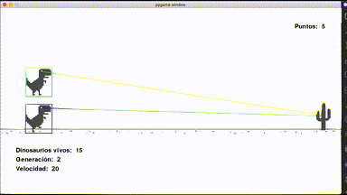

# Dinosaur AI



El juego de dinosaurio del navegador Google Chrome siendo ejecutado por una inteligencia artificial.

[Original](https://www.youtube.com/watch?v=c4CjmTxokeo&list=PL30AETbxgR-d03tf_HIr8-OA1gmClI3mE&index=1)

## Destacables del `main.py`

4 clases: Dinosaur, Obstacles, SmallCactus y LargeCactus.

## En el interior de la clase `Dionsaur`

* `__init__(self, img)`. Se definen las características del dinosaurio.
* `update(self)`. Actualiza posición dinosaurio
* `jump(self)`. Permite saltar al dinosaurio.
* `run(self)`.
* `draw(self, SCREEN)`. Dibuja al dinosaurio


### En el interior de la clase `Obstacle`

Contiene funciones de inicializar, dibujar y actualizar.

### En el interior de las clases `SmallCactus(Obstacle)` y `LargeCactus(Obstacle)`

Inicializa el obstáculo, con la **diferencia entre ambos** de que el **Large** tiene mayor cota y con la **particularidad ambos** de que se le pasa un parámetro `number_of_cacti`.

### Otras funciones

* `remove(index)`. Para borar el dinosaurio. Tiene enlace con `eval_genomes()` porque elimina tanto el dinosaurio como su generación y sus valores de la red generada.
* `distance(pos_a, pos_b)`. Cálculo de distancia entre dos puntos

## Entrenamiento

Se realiza mediante [NEAT (NeuroEvolution of Augmenting Topologies)](https://towardsdatascience.com/ai-teaches-itself-to-play-a-game-f8957a99b628) que está inspirado en el proceso de la evolución.

Generamos muchos dinosaurios y los dejamos jugar (*de forma aleatoria*). Cuanto más lejos lleguen, mejor puntuación obtienen.

Ordenamos toda la población de dinosaurios según resultado y nos quedamos con los mejores, para hacer una evolución del comportamiento de ellos.

Cada Dinosaurio está representado por una red neuronal, por lo que cogemos las redes que llegan más lejos y las utilizamos para la mutación de la siguiente generación.

### Fichero config.txt

* `fitness_criterion`. Determina qué dinosaurios utilizar.
* `fitness_threshold`. Límite para terminar
* `pop_size`. Número de dinosaurios en cada interacción.
* `activation_default`. Determina cómo se calcula la salida dada una entrada.
* `network parameters` (num_hidden -0-, num_inputs -2-, num_outputs -1-).
* `num_inputs`. 1) Coordenada Y del dinosaurio 2) Distancia al captus.
* `num_outputs`. 1) Determina si saltar o no.

El resto de parámetros en [NEAT-Python](https://neat-python.readthedocs.io/en/latest/).

### En el interior de `run(config_path)`

* `config`. Contiene parámetros de configuración.
* `pop`. Población
* `pop.run()`.
* Loop sobre la generación.

### En el interior de `eval_genomes()`

* `ge`. Para guardar los diccionarios de datos de cada dinosaurio.
* `nets`. Para guardar el fichero de configuración de los objetos neuronales de cada dinosaurio.

* `score()`. Cada vez que se llama la función, se incrementa un punto. A los 100 puntos se incrementa la velocidad del juego.

* `background`
  
#### Bucle infinito de `obstacles`

Para puntuar los dinosaurios conforme caen, se ejecuta `fitness -= 1` sobre la generación concreta del dinosaurio.

#### Bucle de `dinosaurs`

De cada dinosaurio se almacena su `(Y, distCactus)` en cada posición

## Toques finales

* Nueva propiedad en clase dinosaurio para hacer un rectangulo alrededor del dinosaurio de un color aleatorio.

* Línea entre el dinosaurio y el cactus siguiente. `54` y `12` son valores agregados de forma manual y determinan el offset. 

* Dashboard para controlar la cantidad de dinosaurios de la generación actual, y el número de generación.

## Para correr el código

1. Genera una ambiente en conda para esto. (yo utilicé python 3.7.10). [Instalar conda](https://docs.conda.io/projects/conda/en/latest/user-guide/install/windows.html)
```conda create --name dinosaurai python=3.7.10```

2. Accede al ambiente de conda creado
```conda activate dinosaurai```

3. Instala **requirements.txt** dentro del ambiente creado (snakeai)
``` pip3 install -r requirements.txt```

4. Ejecuta el fichero `main.py` desde el ambiente creado (snakeai)